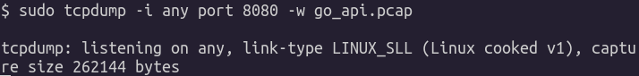
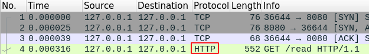

# Redes Linux 

Nessa sessão serão apresentados os tópicos:

* <a href="#modelo-osi">Modelo de camadas OSI</a>&nbsp;
* <a href="#endereçamento-ip">Endereçamento IP</a>&nbsp;
* <a href="#protocolo-tcp">Protocólo TCP</a>&nbsp;
  * <a href="#conteúdo-de-um-pacote-tcp">Conteúdo de um pacote TCP</a>&nbsp;
* <a href="#protocolo-udp">Protocólo UDP</a>&nbsp;
  * <a href="#conteúdo-de-um-pacote-udp">Conteúdo de um pacote UDP</a>&nbsp;
* <a href="#funcionamento-tcp-x-udp">Funcionamento TCP x UDP</a>&nbsp;
* <a href="#demonstração">Demonstração</a>&nbsp;
  * <a href="#tcpdump">TCPDump</a>
  * <a href="#wireshark">Wireshark</a>
* <a href="#links-úteis">Links úteis</a>&nbsp;
  * <a href="#comandos">Comandos</a>
  * <a href="#ferramentas">Ferramentas</a>
  * <a href="#exemplos">Exemplos</a>

---

Em uma breve introdução, redes de computadores são baseadas em diferentes protocolos, que controlam a comunicação em uma ou mais redes. Para entendermos redes temos que falar do `Modelo de camadas OSI`.

### Modelo OSI

No modelo de camada OSI, temos 7 camadas de redes para comunição entre os computadores.


### Resumo:

| Camada | Função |
| --- | --- |
|Aplicação|Funções especialistas (tranferência de arquivos, envio de e-mail, terminal virtual)|
|Apresentação|Formatação dos dados, conversão de códigos e caracteres|
|Sessão|Negociação entre hosts e conexão com outros nós |
|Transporte|Oferece métodos para a entrega de dados ponto-a-ponto|
|Rede|Roteamento de pacotes em uma ou várias redes|
|Enlace (link) de dados|Detecção e, opcionalmente, correção de erros|
|Física|Transmissão e recepção dos bits brutos do meio físico de transmissão|

Falando do `protocolo TCP/IP` as camadas de `Sessão`, `Apresentação` e `Aplicação` são inseridas em uma única camada `Aplicação`.

Na camada de `Aplicação` são encontramos as implementações de serviços como SSH, DNS, SMTP, HTTP, SNMP.

### Endereçamento IP

O endereço IP é um rótulo numérico atribuído a um dispositivo (computador, impressora, smartphone) conectados a uma rede de computadores. O endereço IP conta com duas versões: `IPv4`, que define um endereço numérico de `32 bits`; `IPv6`, que define um endereço com `128 bits`.

O endereçamento `IPv4` é escrito com quatro octetos representados no sistema numérico decimal como, por exemplo, `192.168.0.25`. A primeira parte `192.168.0` identifica um rede específica e a segunda parte `.25` representa um host dentro dessa rede.

O IP acima é um exemplo de endereço de `classe C`. Classes, se tratando de IP, são estruturas de tamanho fixo onde os endereços de IP são categorizados.

|Classe|Gama de endereços| N de endereços por rede |
| --- | --- | --- |
|A|0.0.0.1 até 126.255.255.255|16.777.216 |
|B|128.0.0.0 até 191.255.255.255|65.536|
|C|192.0.0.0 até 223.255.255.255|256|
|D|224.0.0.0 até 239.255.255.255|[Multicast](https://pt.wikipedia.org/wiki/Multicast)|
|E|240.0.0.0 até 255.255.255.254|Uso futuro; atualmente reservada a testes pela [IETF](https://pt.wikipedia.org/wiki/Internet_Engineering_Task_Force)|

Além disso, cada endereço possui sua respectiva ` máscara de sub-rede`, também conhecida como `subnet mask` ou `netmask`, que é um número de 32 bits usado em um IP para separar a parte correspondente à rede pública, à sub-rede e aos hosts. Essa divisão pode ser feita através desse [cálculo](https://www.todoespacoonline.com/w/2015/06/calculo-de-sub-redes-ipv4/).

Beleza!  Isso é uma introdução para conversarmos um pouco sobre essas ultimas 3 camadas que vimos:
 - Network : IP
 - Transport: TCP / UDP
 - Application: SSH / DNS / HTTP

Na camada de `rede` temos a tradução de um MAC Address para um IP (ex: `192.168.0.1`) e na camada de `transporte` temos o uso dos protocolos  `TCP` e `UDP`.

Mas qual é a diferença e o funcionamento entre esses dois protocolos?

### Protocolo TCP

Quando se abre uma comunicação via TCP é preciso passar pelo famoso `Handshake` ou `Three-way handshake`. Isso acontece quando, por exemplo, um `servidor x` inicia a comunicação com outra máquina mandando uma mensagem dizendo "quero falar com você". Para que isso aconteça o `servidor x` precisa incluir uma flag (`SYN`) nessa mensagem identificando o ínicio da conversa entre as duas máquinas.

O `servidor y` recebe esta mensagem com a flag de inicio de conversa e responde com uma flag (SYN-ACK) dizendo que recebeu a mensagem do `servidor x`. De volta ao `servidor x`, ele responde com outra flag (ACK) dizendo que recebeu a resposta do `servidor y` e assim se inicia uma sessão TCP.

## Conteúdo de um pacote TCP


- Source Port: É a porta onde é iniciada a comunicação do servidor de envio.
- Destination Port: É a porta do servidor de destino.
- Sequence Number: Indica a sequencia dos segmentos de dados que estão sendo enviados.
- ACK Number: Número que define quem é o próximo Sequence Number.
- Data Offset: Indica o tamanho do Header TCP.
- Reserved: Representa o bit reservado para usos especificos onde existem varias implementações fora das normas comuns.Normalmente é definido com zero.
- Flags: Como falamos antes pode ser um SYN, ACK, FIN, RST e normalmente é definido com um bit ligado para a flag q será usada.
- Checksum: Sequencia numérica que identifica o pacote.
- Urgent Pointer: Normalmente configuirado como 1 ( ligado ), comumente usado em quebras de conexões, em limpeza da pilha TCP e também para que o pacote seja entregue mais rapidamente à aplicação.
- Options: São opcoes adicionais que se pode colcoar no pacote.

## Protocolo UDP

UDP é um pouco diferente do TCP. Quando existem uma comunicação com um outro servidor usando protocolo UDP, simplesmente cria-se um pacote e o envia, sem necessidade de iniciar uma sessão ou de comunicação previa. Além disso, nessa comunicação não se espera por confirmação de recebimento ou nada do genero. Isso faz com que a comunição entre os servidores seja muito mais leve e simplificada. Mas também tem seus pros e contras.

## Conteúdo de um pacote UDP:


Source Port: É a porta onde é iniciada a comunicação do servidor de envio.
Destination Port: Porta do servidor de Destino.
Length: Tamanho do pacote UDP.
Checksum: Sequencia numérica que identifica o pacote.

## Funcionamento TCP x UDP

O protocolo TCP garante que o conteúdo que está sendo trafegado está em uma ordem e garante menos erros de transmissão, por isso acaba sendo o protocolo comum para muitas implementaçoes de aplicações que conhecemos como HTTP / SSH e etc...
UDP é otimo para aplicações de stream, como a do Twitch, Netflix ou jogos onde o Handshake do TCP pode causar atrasos e retranmissões de pacote, e isso por sua vez causaria problemas nas montagens dos frames.
No TCP por outro lado, se tem a confirmação de que o servidor que você quer se comunicar esta recebendo seus pacotes devidamente.


## Demonstração

### TCPDump

[Iniciando](../README.md) a [API](../exemplos/go_api) em Go será criado um servidor que escuta na porta 8080. A API aceita as rotas:

```/read```</br>
```/break```</br>
```/write```</br>

Em um terminal, execute a ferramenta `tcpdump` para capturar o tráfego da API em execução:

```sudo tcpdump -i any port 8080```


ou, redirecionando o tráfego para um arquivo para posteriormente analisarmos os pacotes no `wireshark`.

```sudo tcpdump -i any port 8080 -w go_api.pcap```



[Execute](../) a API em outro terminal e acesse no seu navegador o endereço `localhost:8080/read` (por exemplo) para acessar a API na porta 8080 na rota `read` para gerarmos tráfego na rede. Você pode fazer o mesmo com as de mais rotas disponíveis.

> Não esqueçam de usar o `CTRL + C` para finalizar o comando acima e gerar o nosso arquivo `.pcap`

### Wireshark

Agora vamos lá abrir o `wireshark` e ver como isso funciona.


Na imagem acima temos a comunição do cliente (nossa máquina, `Source`) com  com o servidor (go_api, `Destination`) ou `three-way handshake (acordo de três vias)`. Temos, também, o protocolo de comunição (`Protocol`), o tamanho do pacote (`Length`) e informações detalhadas como foi essa comunicação (`Info`).

No campo `Info`, são apresentadas algumas flags que descrevem a comunicação entre o cliente e o servidor. Na imagem anterior há o pedido de conexão do cliente ao servidor, com o envio da flag `SYN` (synchronize). O pedido de conexão é aceito pelo servidor com o envio das flags `SYN` `ACK` (acknowledgment). Por fim o cliente envia um `ACK` ao servidor confirmando a conexão.

Assim como há flags para representar a comunicação do protocolo TCP, temos a comunicação do protocolo HTTP, de acordo com a configuração da aplicação que usa este protocolo.



A imagem acima mostra o cliente enviando méetodo de requisição do tipo `GET` ao servidor, na rota `/read` da `go_api`.

Saiba mais sobre [métodos de requisição HTTP](https://developer.mozilla.org/pt-BR/docs/Web/HTTP/Methods)

</br>
Tem um livro muito bom com vários testes legais para vocês pegarem o jeito!
Junto com o livro, vocês podem baixar os arquivos `pcap` do `wireshark` que estão dentro do arquivo `.zip` para vocês brincarem.

 `Livro e arquivos`: [NoStarch](https://nostarch.com/packetanalysis3)

</br>

### Vamos aprender mais um pouco ?

- [Window size](https://www.networkcomputing.com/data-centers/network-analysis-tcp-window-size)
- [FIN vs RST](https://ipwithease.com/tcp-fin-vs-rst-packets/)
- [Retransmissions](https://accedian.com/blog/network-packet-loss-retransmissions-and-duplicate-acknowledgements/)

</br>

---
</br>

## Links úteis:

### Comandos

- [Throubleshooting](COMMANDS.md)
### Ferramentas

- [Wireshark](https://www.wireshark.org/)

- [TCPDump](https://www.tcpdump.org/)

- [NMAP](https://nmap.org/)

### Exemplos 

- [Amostra de capturas](https://gitlab.com/wireshark/wireshark/-/wikis/home)

- [Download de capturas de pacotes](https://nostarch.com/download/ppa3ecaptures_updated.zip)