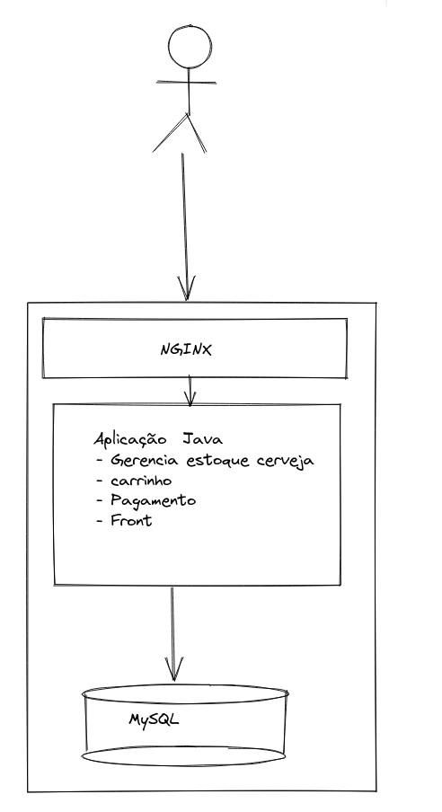
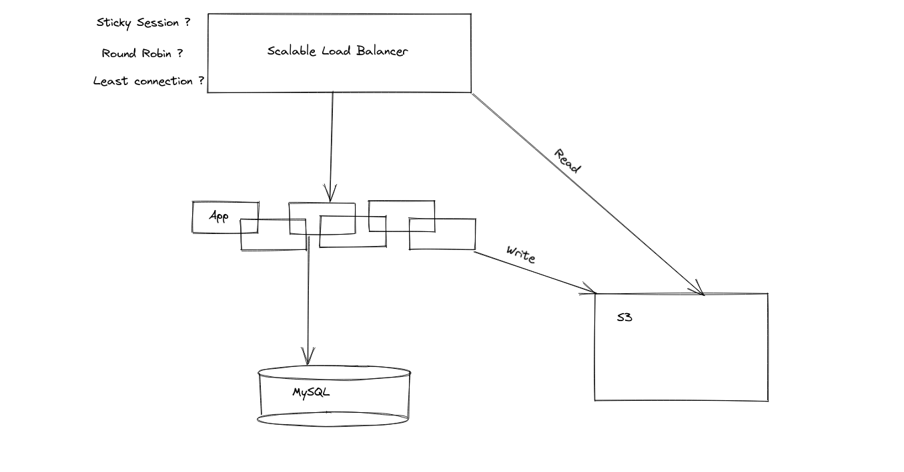
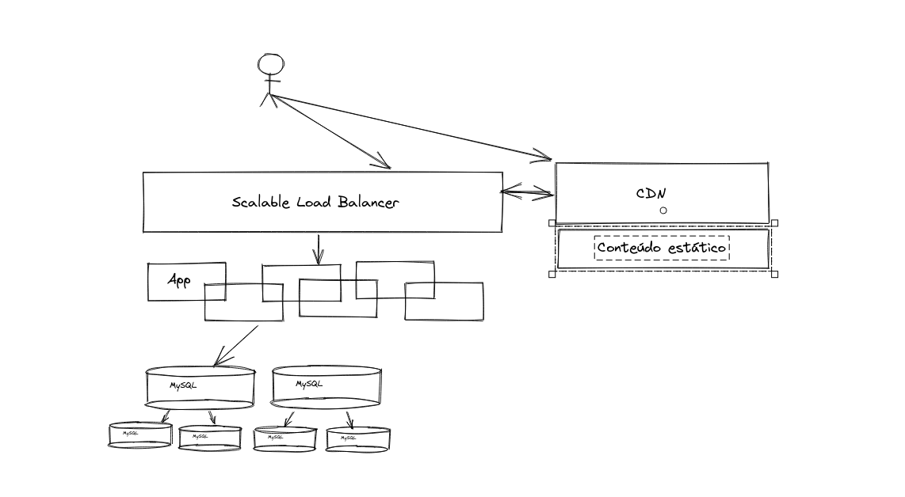

# Livros

1 - https://www.oreilly.com/library/view/web-scalability-for/9780071843669/
2 - https://www.goodreads.com/en/book/show/54109255-system-design-interview-an-insider-s-guide
3 - https://www.oreilly.com/library/view/designing-data-intensive-applications/9781491903063/

# Desenhos de feitos na aula

Figura 1.0: Define uma estrutura basica sem escalabilidade, e com um unico servidor contendo multplos serviços.

Figura 1.1:  Mostra um serviço distribuido em varios servidores e usando tecnologias diferente, com  um nivel minimo de disponilibilidade dentro dos requerimentos definidos do problema.
Pontos de ressalta e estudo.
- Funcionamento de [Load Balancer](https://en.wikipedia.org/wiki/Load_balancing_(computing)):
	- Como funciona [Round Robin](https://en.wikipedia.org/wiki/Round-robin)
	- O que é [Sticky-sessions](https://www.imperva.com/learn/availability/sticky-session-persistence-and-cookies/)
	- [Least Connection](https://docs.citrix.com/en-us/citrix-adc/current-release/load-balancing/load-balancing-customizing-algorithms/leastconnection-method.html)
- Horizontal scale vs Vertical scale (scale in/out, scale up/down) 
- Object storage vs block storage
- Relational DB vs Non-Relational DB

Figura 1.2: Mostra escale de Banco de dados com Multi Master setup e replicas, adicionamos neste desenho uma CDN para conteúdo estático, como imagens, para que reduza a quantidade de requisições a ser processada pelo serviço principal, deixando-o focado somente para processamento de retorno dinâmico.

- Banco de dados Multi Master devem sempre existir de uma forma que contenha os dados para facil acesso e facil escrita, comumente usa-se uma "endpoint" diretamente para as Réplicas e outro para os Masters.
	- Endpoint para as replicas servindo requisições de READ
	- Endpoint master servindo requisições de WRITE.

Figura 1.3: Definimos na figura abaixo apenas outros serviços, ou abordagens,  que devem ser considerados quando desenhando um sistema. Deve-se entender os requerimentos que vão te trazer a suas decisões e também os "trade-offs" que serão feitos, para que se escolha uma decisão por outra. 

